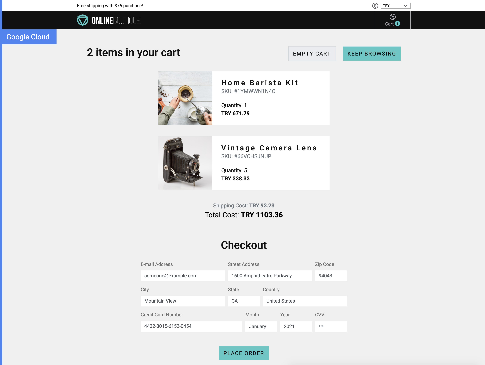

# microservices-demo-multirepo-portfolio
[MSA 데모](https://github.com/dibisis/microservices-demo)를 기반으로 AWS EKS환경으로 배포 자동화 
Tech : K8S(EKS), MSA, gRPC, CI/CD(CircleCI), Cloudflare, Locust

# 기존 MSA demo에서 변경점
* monorepo => multirepo
* CI/CD 추가(CircleCI)
* ELB의 CNAME을 지정한 도메인으로 연결(Cloudflare API, CircleCI)
* GKE => AWS EKS


## Service Architecture

**Online Boutique** 는 마이크로서비스간 통신에 gRPC를 사용하는 MSA demo project

[](./docs/img/architecture-diagram.png)

gRPC의 Protocol Buffer Description은 각 repo의 ./pb 

| Service                                              | Language      | Description                                                                                                                       |
| ---------------------------------------------------- | ------------- | --------------------------------------------------------------------------------------------------------------------------------- |
| [frontend](https://github.com/dibisis/microservices-demo-frontend/)                           | Go            | Exposes an HTTP server to serve the website. Does not require signup/login and generates session IDs for all users automatically. |
| [cartservice](https://github.com/dibisis/microservices-demo-cartservice)                     | C#            | Stores the items in the user's shopping cart in Redis and retrieves it.                                                           |
| [productcatalogservice](https://github.com/dibisis/microservices-demo-productcatalogservice) | Go            | Provides the list of products from a JSON file and ability to search products and get individual products.                        |
| [currencyservice](https://github.com/dibisis/microservices-demo-currencyservice)             | Node.js       | Converts one money amount to another currency. Uses real values fetched from European Central Bank. It's the highest QPS service. |
| [paymentservice](https://github.com/dibisis/microservices-demo-paymentservice)               | Node.js       | Charges the given credit card info (mock) with the given amount and returns a transaction ID.                                     |
| [shippingservice](https://github.com/dibisis/microservices-demo-shippingservice)             | Go            | Gives shipping cost estimates based on the shopping cart. Ships items to the given address (mock)                                 |
| [emailservice](https://github.com/dibisis/microservices-demo-emailservice)                   | Python        | Sends users an order confirmation email (mock).                                                                                   |
| [checkoutservice](https://github.com/dibisis/microservices-demo-checkoutservice)             | Go            | Retrieves user cart, prepares order and orchestrates the payment, shipping and the email notification.                            |
| [recommendationservice](https://github.com/dibisis/microservices-demo-recommendationservice) | Python        | Recommends other products based on what's given in the cart.                                                                      |
| [adservice](https://github.com/dibisis/microservices-demo-adservice)                         | Java          | Provides text ads based on given context words.                                                                                   |
| [loadgenerator](https://github.com/dibisis/microservices-demo-loadgenerator)                 | Python/Locust | Continuously sends requests imitating realistic user shopping flows to the frontend.      
                                        |
## Screenshots

| Home Page                                                                                                         | Checkout Screen                                                                                                    |
| ----------------------------------------------------------------------------------------------------------------- | ------------------------------------------------------------------------------------------------------------------ |
| [](./docs/img/online-boutique-frontend-1.png) | [](./docs/img/online-boutique-frontend-2.png) |
## Tech Stack

- **[Kubernetes](https://kubernetes.io)/AWS EKS**
- **[gRPC](https://grpc.io)** 
- **[Istio](https://istio.io):** service mesh.
- **[OpenCensus](https://opencensus.io/) Tracing:** 
- **[Skaffold](https://skaffold.dev):** Kubernetes 개발자도구
- **[Locust](https://locust.io/):** load generator

## 사전 준비
### AWS EKS provisioning with budget config
```
# spot instance 를 이용한 EKS 인프라 설정
eksctl create cluster -f eksctl-spot.yaml
```

```
# redis 설치
kubectl apply -f redis.yaml
```

## CircleCI 환경변수
### context
* dockerhub
  * $DOCKERHUB_PASS
  * $DOCKERHUB_USERNAME
* awsauthdibisis # 사용자의 aws auth 정보
  * $AWS_ACCESS_KEY_ID
  * $AWS_DEFAULT_REGION
  * $AWS_SECRET_ACCESS_KEY